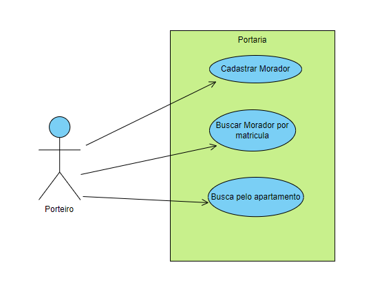
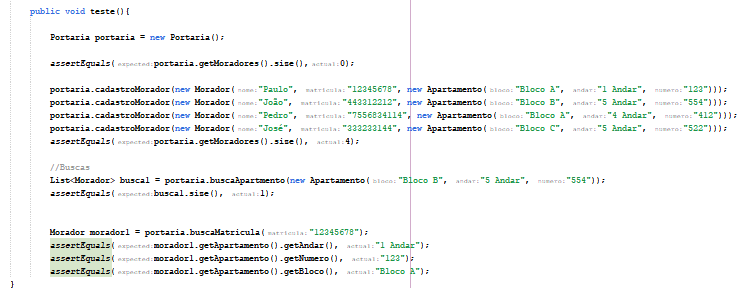

# Comente
"We see three critical differences between programming and software engineering: time, scale, and the trade-offs at play. 
On a software engineering project, engineers need to be more concerned with the passage of time and the eventual need for change. 
In a software engineering organization, we need to be more concerned about scale and efficiency, both for the software we produce 
as well as for the organization that is producing it. Finally, as software engineers, we are asked to make more complex decisions with higher-stakes outcomes, 
often based on imprecise estimates of time and growth. Within Google, we sometimes say, “Software engineering is programming integrated over time.” 
Programming is certainly a significant part of software engineering: after all, programming is how you generate new software in the first place. 
If you accept this distinction, it also becomes clear that we might need to delineate between programming tasks (development) and software engineering tasks (development, modification, maintenance). 
The addition of time adds an important new dimension to programming. Cubes aren’t squares, distance isn’t velocity. Software engineering isn’t programming."

Titus Winters, Software Engineering at Google

"Engenharia de Software é a área da tecnologia em que é estudado todos os processos da construção de um software, desde o projeto de elaboração até a sua manutenção. 
Depois de todo o processo de construção e constante melhoria do software, ele poderá e deve sofrer alterações de erros e manutenção para que o sistema não se torne obsoleto."

# Ciclo de Vida de Software

Exemplo utilizado: Portaria

Requisitos Funcionais
- Porteiro (Ator) pode cadastrar novos moraddores ao condomínio e seus respectivos apartamentos;
- Porteiro póde realizar a busca e moradores atraves do apartamento;
- Porteiro pode realizar a busca de moradores atraves da matricula do morador;

Requisitos Não Funcionais:
- Velocidade nas respostas do sistema
- Interface agradavel e simples

Diagrama de caso de uso:

 

# Testes
Testes desenvolvidos

 
